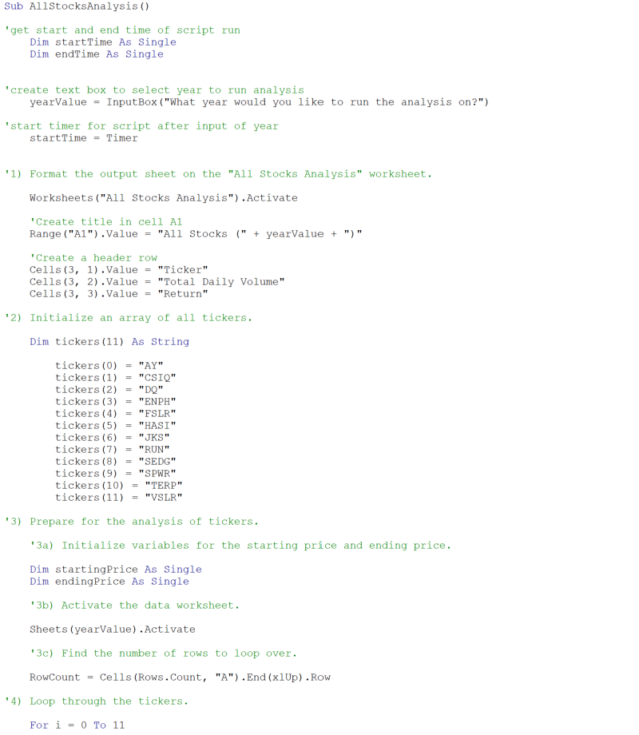
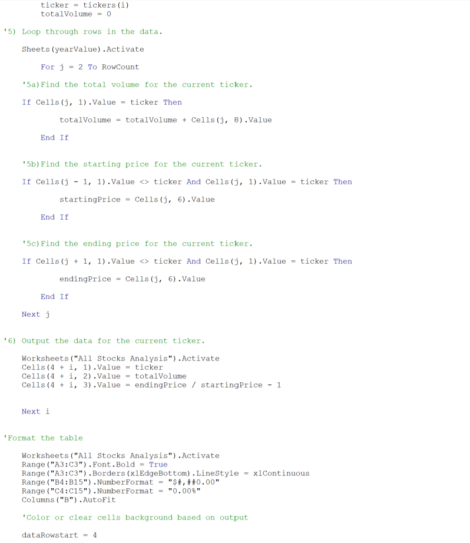
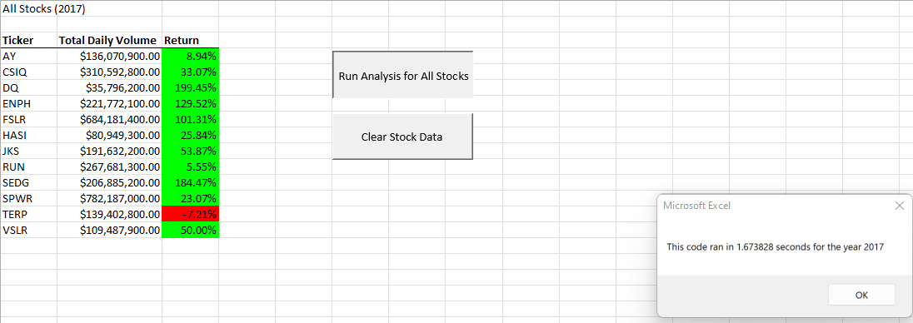
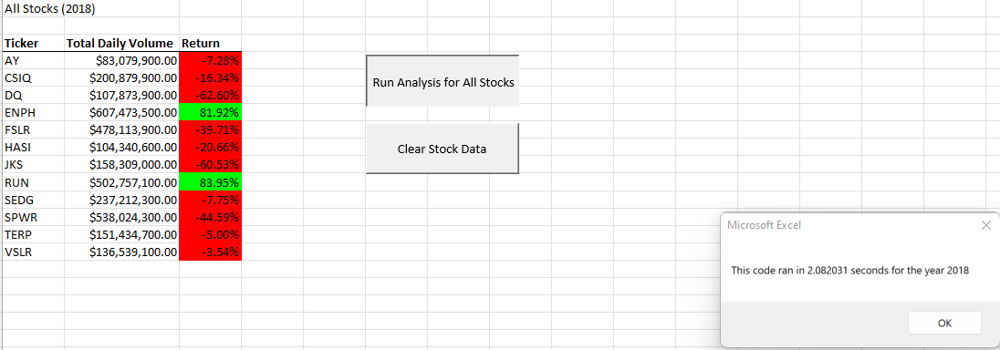
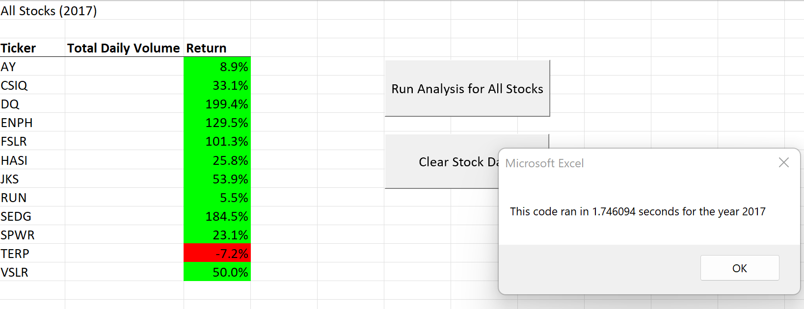
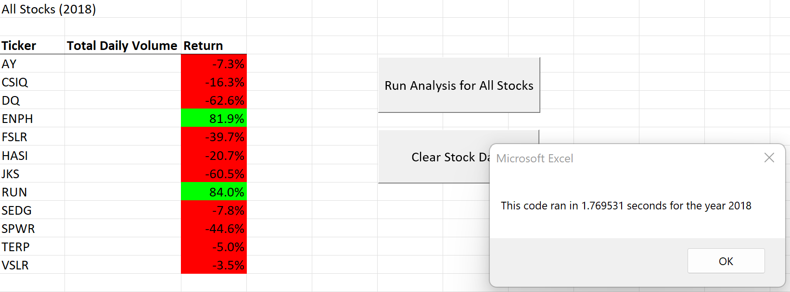

# Stock Analysis with Refactor VBA Code and Excel

## Refactor VBA Code Stock Analysis

### Purpose

The purpose of this analysis is to provide a workbook that allows steve to analyze an entire dataset with a click of a button.  More specifically I edited (refactored) prior code to loop through all the data one time in order to collect the same information.  Based upon the refactored code, I am to determine and explain whether refactoring code successfully made the VBA script run quicker than before.

### Results

Multiple steps were taken as part of this analysis.  This first required me to successfully create code in the module two lesson that shows the total daily volume and return for given stock tickers for 2017 and 2018, depending upon which year was input in the pop up box.  In addition to seeing the desired daily volumes and returns, the code is supposed to display the amount of time it took to run the VBA script.  

The first and second screenshots below show excerpts of the original code used.

The following screenshots shows the runtime using the original not factored code for 2017 and 2018.

*Refactored Code*

The second step required me to refactor the existing VBA code and measure it's performance agaisnt the prior code.  The main changes made were the creation of a ticker index and creation of three output arrays that were looped through.  If you wish to see the script in more detail please refer to the developer tool window within the macro enabled excel file (VBA_Challenge.xlsm).

The following screenshot shows the runtime using the refactored code for 2017 and 2018.

### Summary

In general there are advantages and disadvantages of refactoring code.  Some advantages of refactoring code is making the code more efficient—by taking fewer steps, using less CPU memory, or making the code easier to read by improving the logic.  A disadvantage of refactoring code is the amount of time spent refactoring may not outweigh the end benefit of having refactored code.  In this instance the run times were not significantly different.  The original code took and took 1.67 seconds for 2017 results, and 1.74 seconds for the refactored code.  For 2018, the original code took 2.08 seconds compared to 1.76 seconds for the refactored code.

In this instance, the original script runs quick enough for the purpose and size of the ticker data pool.  If the ticker data pool were to expand, such as 1000 stocks, the refactored script likely would run noticeably quicker and justify the time spent to refactor the code.
